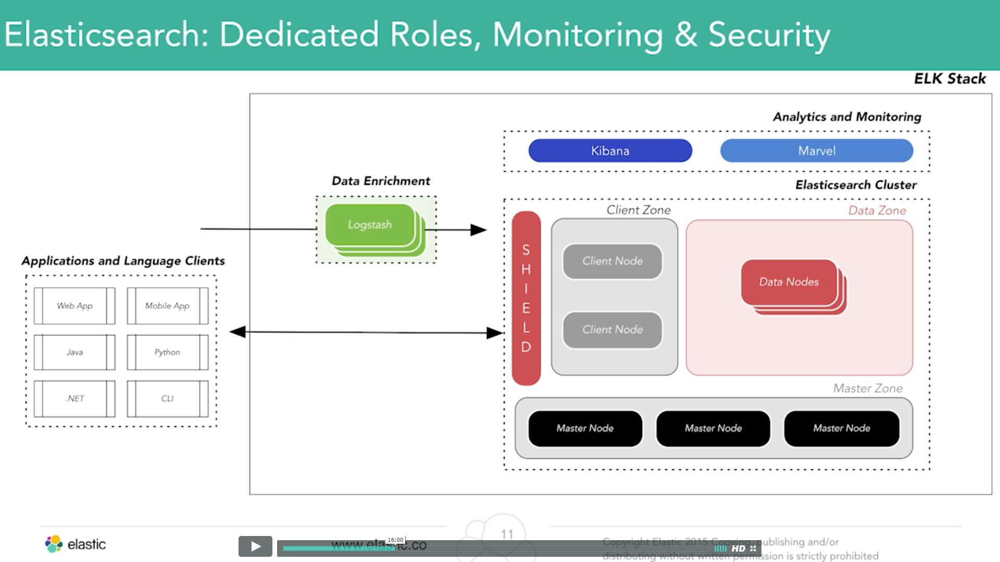
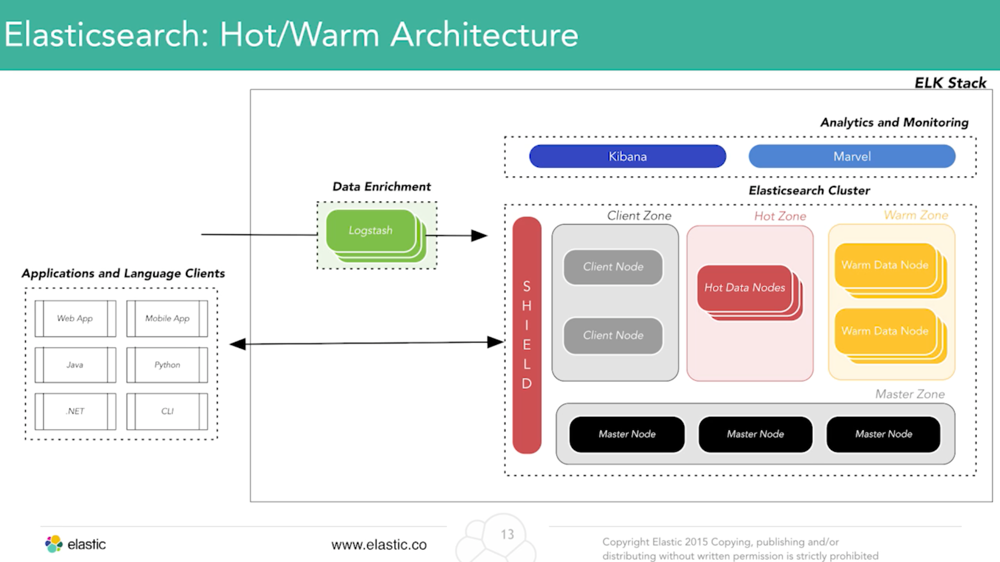

# [Elasticsearch at scale](https://www.elastic.co/webinars/es-at-scale)

You like it, you love it, want some more of it? Don’t worry, you are not alone in your desire to expand and scale your Elasticsearch deployment. Join Elastic’s Solutions Architect, Alan Hardy, for a presentation on Elastic’s Reference Architecture and discussion on designing for scaling.

Chris Earle, Elastic Support Engineer, will then dive into one of the most frequent problems with scaling Elasticsearch workloads: fielddata.

## Identifying bottlenecks:

* Identify system resource utilization under load
* start with single Elasticsearch node (no replicas)
* stress the system with realistic production Index/query rates
* identify resource boundary limits: CPU (<75%), Memory, I/O, Network
* identify max shard size, measure query latency at increased documents
  * as shard size increases, maybe the query latency response time increases as well

## Elasticsearch

* config:
  * JVM Heap
  * disable swap
  * mapping templates
  * doc_values
* cpu:
  * tokenization
  * number of fields
  * analyze/not_analyzed
* memory:
  * query sort
  * aggregations with high cardinality (many unique values in a set)
* i/o:
  * ssd/hdd
  * RAID0
  * scheduler (noop)

## Logstash

* bulk size, filter worker threads (-w), host array

## High Availability: Elasticsearch

* cluster size: 3 nodes minimum for high availability (HA) cluster
* minimum_master_nodes = int((number of master-eligible nodes / 2) + 1)
  * this is called "quorum"
* replication factor to distribute data across nodes so we can handle failure of single instance

## High Availability: Elasticsearch and Logstash

* Load balancer => multiple Logstash nodes => ES cluster
* load balancer - distributes load over multiple Logstash instances
* Logstash (host array) - distributes load across the Elasticsearch cluster
  * scale out horizontally

## Logstash: Resiliency and Backpressure

* Need to be able to handle backpressure in cases where Logstash goes offline
* put message queues in front of Logstash
  * message queues will handle requests if they get backed up
* Logstash input: Redis, RabbitMQ, Kafka
  * logstash outage resiliency, handle throughput spikes
  * scale out horizontally

## Elasticsearch: dedicated roles, monitoring, and security

* specialized roles
  * if a node is handling both data and master role, which both utilize memory resources, there is a possibility that trying to do one role will interrupt the other
* master nodes:
  * dedicated 3 master eligible nodes. One will be elected at a given time. In the event of failure, another node will take over
  * cluster health management
* data nodes:
  * handle index/query requests
* client nodes:
  * smart load balancing
  * co-ordinating query/aggs
  * performs interaction with external components
  * talks to data nodes and coordinates response that comes back
  * minimize network hops to find data associated with queries
* security (ie. shield)
  * role/permission API access
  * audit and IP filtering

## Elasticsearch: Hot/Warm architecture

* split data nodes based on hardware specifications
  * hot - there is a set of data that is highly relevant and has high indexing throughput requirements; also is highly queried and
    * higher hardware spec
    * faster disk I/O
    * lower response times
    * handles index and query
  * warm - done being indexed and is less queried
    * lower hardware spec
    * slower I/O
    * higher data storage ratio
    * less query, lower response
* Features
  * tag nodes (type: hot/warm)
  * routing.allocation.require.type
  * use Curator 3.0

---

# Fielddata

See blog post: https://www.elastic.co/blog/support-in-the-wild-my-biggest-elasticsearch-problem-at-scale

Trouble making Elasticsearch perform well on queries that Lucene is not necessarily good at (it doesn't utilize the inverted index):
* sorting
* [most] aggregating
* scripting
* these all load fielddata, which uninverts your index

## Cause

* Inverted index is what gets written to disk when you are indexing data into Elasticsearch.
* The inverted index is like an index at the end of a book, mapping terms to the places they show up
* this data structure is not particularly good at sorting or scripting

* so if you needed to sort by the 'title' field, for example, ES would go through every document and load the title field into memory for EVERY SINGLE DOCUMENT, then sort it. ES holds onto this, and it is called 'fielddata'.
* fielddata (in short): when sorting/aggregating/scripting, go into inverted index, uninvert it, hold on to field content in memory
* this has a tremendous cost at scale; usually is a growing problem that surprises you down the road.
* if fielddata is loaded by default; it never goes away (with a few exceptions)
  * ie. if you shut down a node, or close an index

## Effect of fielddata

* first response is going to be slow because building the data is very expensive
* follow on requests don't have up front costs; responses will be quicker
* say you never request that field again: for the rest of the node's life, that data will live in your heap. This could easily be GB in fielddata
* longer garbage collection because it has to walk the memory old to realize that it can't free the memory
* slows down everything
* risks running out of memory; node dies...
* fielddata can take up to 60% of your heap
* ES is configuring by default to kick off garbage collection at 75%
* this means that you'll start to see impact with only 15% used by other processes, which is very bad

## How does fielddata really work?

* "fielddata circuit breaker" - ES trying to prevent this problem from happening
  * blocks any request that tried to allocate more than 60% of your heap
* starting from 0% heap...
  * first request comes in, needs 30% of heap
  * circuit breaker says fine
  * goes through slow process of allocation..
  * request done
* now at 30%
  * request comes in, needs 20%.. same thing
* now at 50%
  * request comes in, needs 15%
  * blocked immediately
* if you see a fielddata circuit breaker block in the logs, you need to handle it

## Solution

* Doc Values
  * must be enabled for every field **individually**
  * enabled by default in ES 2.0+
  * writes to a different store next to the inverted index during the indexing process
  * must do it before the index is created
  * conceptually, it replaces fielddata
  * should not have a significant memory impact
* dramatically reduce fielddata circuit breaker
  * set it 5 or 10% instead of 60%
  * this will help you catch the problem without destroying your heap
* if you have standalone indexes, you need to set up a strategy to reindex gradually
* ES is saying the doc values are the way to go and moving away from fielddata

## Exception

* Analyzed strings not supported by doc values
  * this is the default type when you index a field like "this is the quick brown fox"
  * analyzed strings are what makes full text search work
  * tokenization process makes it confusing to figure how to use with doc values
  * ask yourself, what would you sort against in a huge field with a bunch of tokens in it?
  * you are doing it wrong if you are sorting, aggregating, or scripting against an analyzed string
    * only sorting should be if you are looking at the tokens themselves
    * only aggregation you should use against analyzed strings is "significant terms"
  * prefer 'not_analyzed' strings for sorting, scripting, and aggregating in all other cases
  * whenever they get issues are memory pressure or performance problems, they immediately look for fielddata. There is a way to check cluster for fielddata. See blog post.

## Q & A

* if you are just doing a query, fielddata does NOT come into play; only sort, aggregating, or script
* lower the circuit breaker down to 5 or 10% to *fail fast*
* mapping settings, you cannot change them on the fly
* config settings (in config file), just need to be applied by restarting the node
* circuit breaker is a node by node setting
* 2 master nodes are no better than 1 master node; you can have "split brain"
  * split brain - 2 master eligible nodes lose communication with each other and both think the other died. The existing elected master will remain a master, and the other will elect itself master because it thinks the cluster no longer has one. Because it is the job of the master to allocate shards across nodes, the node with the replica shard will promote it to a primary shard. Now you have a cluster with 2 elected masters and 2 primary shards of the same index
* in a cluster with dedicated roles, you should have a minimum of 3 master eligible nodes with a minimum_master_nodes set to 2 (quorum)
  * you should put each master node in its own availability zone
* use of client nodes predominantly benefits queries, and ability to offload index routing, take load off of data node
* don't spread nodes across regions; the downsides really outweigh the upsides
* if you want to span regions, spin up two clusters and figure out a replication strategy to keep the clusters consistent
